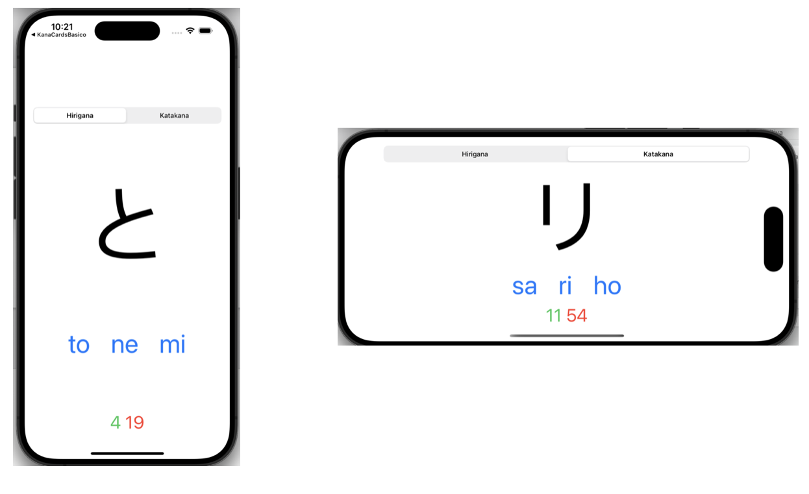

# KanaCards básico

## Requisitos

El interfaz de usuario deberá tener este aspecto:

## Restricciones

- Proyecto de tipo iOS App
- Aplicación desarrollada en SwiftUI con estructura MVVM
- En el fichero Silabarios.swift ya están incluidos los diccionarios con las correspondencias
- Utilizar Stack Views para agrupar los elementos
- Orientación vertical y horizontal
